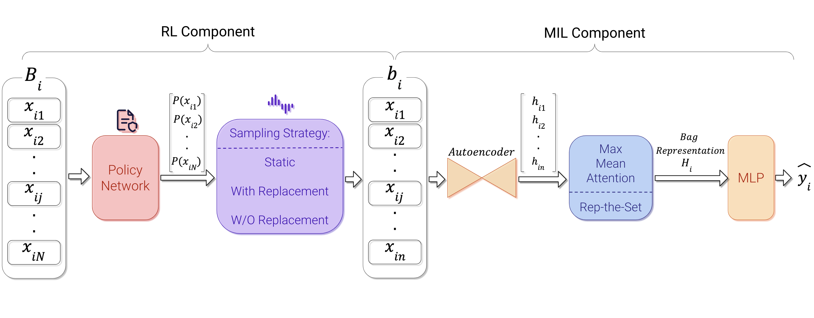

# RL-MIL-NAACL2024

Source code for **[Reinforced Multiple Instance Selection for Speaker Attribute Prediction](https://aclanthology.org/2024.naacl-long.181.pdf)** accepted at NAACL 2024.

## Overview



## Prerequisites

- python 3.10+
- Ubuntu GPU-enabled server with CUDA 12.1+
    - Check your GPUs with `nvidia-smi`
- python environment with packages installed as in `requirements.txt`
- [Weights and Biases](https://wandb.ai/) Account

## Setup Environment

```bash
cd ROOT_OF_THE_REPO
mkdir -p data/jigsaw
```

```bash
python3 -m venv venv
source venv/bin/activate
pip install --upgrade pip
pip install -r requirements.txt
```

To run the experiments, you need to login to your Weights and Biases account. You can do that by running the following command and following the instructions:

```bash
wandb login
```

### Datasets

#### Synthetic Data

1. Download the `train.csv.zip` file from [Kaggle's Toxic Comment Classification Challenge](https://www.kaggle.com/competitions/jigsaw-toxic-comment-classification-challenge)
2. Unzip the file resulting in `train.csv`
3. Place the file in `data/jigsaw/`

#### Congressional Speech Data

1. Download the `hein-daily.zip` file from [Congressional Record for the 43rd-114th Congresses: Parsed Speeches and Phrase Counts](https://data.stanford.edu/congress_text)
2. Unzip the file resulting in `hein-daily` directory
3. Place the directory in `create_dataset/Political_Dataset/`
4. Download the `congress-terms.csv` file from [Congress Age GitHub Repository](https://github.com/fivethirtyeight/data/tree/master/congress-age)
5. Place the file in `create_dataset/Political_Dataset/`
6. Run the following command to create the merged dataset (including age column):
    ```bash
    cd create_dataset/Political_Dataset
    ./preprocess_speeches.sh
    ```
7. You can see the `political_data.csv` file under `data` directory.


#### Facebook Data

Dataset is private and introduced in the following paper:
```
Kennedy, B., Atari, M., Mostafazadeh Davani, A., Hoover, J., Omrani, A., Graham, J., & Dehghani, M. (2021). Moral concerns are differentially observable in language. Cognition, 212, 104696. doi:10.1016/j.cognition.2021.104696
```
Please contact the authors for more information.


## Running the Experiments

### Script for data preparation

The shell script `scripts/prepare_dataset.sh` will prepare the data for training, validation and testing. Here are the variables that you can set along with their descriptions:

| Variable                    | Description                                                                                                                                                                                    |
| --------------------------- | ---------------------------------------------------------------------------------------------------------------------------------------------------------------------------------------------- |
| `dataset`                   | Possible values of dataset: `political_data_with_age` `facebook` `jigsaw`                                                                                                                      |
| `whole_bag_size`            | For `jigsaw` datasets: `50` <br> For `political_data_with_age` and `facebook` datasets: `100`                                                                                                  |
| `num_pos_samples`           | This argument is **only** used in `jigsaw` datasets, it is the number of toxic instances that will be added to the bag (5 is used for making `jigsaw_5` and 10 is used for making `jigsaw_10`) |
| `embedding_model`           | This argument will determine the model that will be used to get the embeddings of the data. We used `roberta-base` in all settings                                                             |
| `data_embedded_column_name` | This argument will determine the name of the column that has the text data. <br> For `facebook` and `political_data_with_age` datasets: `text` <br> For `jigsaw` datasets: `comment_text`      |
| `random_seeds`              | Random seeds are an array of integers that will make different splits of the data                                                                                                              |
| `gpus`                      | It define the array of integers that are indexes of the GPUs that will be used to create embeddings of the data                                                                                |

```bash
dataset="jigsaw" # or "political_data_with_age" or "facebook"
whole_bag_size=50 # or 100
num_pos_samples=5 # only used in jigsaw datasets, 5 for making `jigsaw_5` and 10 for making `jigsaw_10`

data_embedded_column_name="comment_text" # or "text"

random_seeds=(0 1 2 3 4)
gpus=(0 1 2 3 4)
```

After setting the variables, you can run the script as follows:

```bash
cd scripts
./prepare_dataset.sh
```

After that for each random seed, a folder will be created in `data/` directory (e.g. `data/seed_10/`).

### Scripts for running the MIL experiments

#### `scripts/run_mil.sh`
The shell script `scripts/run_mil.sh` will run the MIL experiment for a single dataset and `random_seed` 0. Here are the variables that you can set along with their descriptions:

| Variable                    | Description                                                                                                                                    |
| --------------------------- | ---------------------------------------------------------------------------------------------------------------------------------------------- |
| `baseline_types`            | Possible values: `MeanMLP` `MaxMLP` `AttentionMLP` `repset`                                                                                    |
| `target_labels`             | Facebook dataset: `care` `purity` `loyalty` `authority` `fairness` <br> Political dataset: `age` `gender` `party` <br> Jigsaw datasets: `hate` |
| `gpus`                      | The same description as above                                                                                                                  |
| `embedding_models`          | The same description as above                                                                                                                  |
| `bag_sizes`                 | The bag size ($b_i$) in the paper. We used `20`` in all experiments                                                                            |
| `autoencoder_layer_sizes`   | The layer sizes of the autoencoder. We used `"768,256,768"` in all experiments                                                                 |
| `wandb_entity`              | Your Weights and Biases entity                                                                                                                 |
| `wandb_project`             | Your Weights and Biases project name                                                                                                           |
| `dataset`                   | The same description as above                                                                                                                  |
| `data_embedded_column_name` | The same description as above                                                                                                                  |
| `task_type`                 | Always `classification`                                                                                                                        |

```bash
baseline_types=("MeanMLP" "MaxMLP" "AttentionMLP" "repset")

# For facebook dataset: ("care" "purity" "loyalty" "authority" "fairness")
# For political_data_with_age dataset: ("age" "gender" "party")
# For jigsaw datasets: ("hate")
target_labels=("care" "purity" "loyalty" "authority" "fairness")

gpus=(0 1 2 3 4 5 6 7)

# wandb config
wandb_entity="YOUR_WANDB_ENTITY"
wandb_project="YOUR_WANDB_PROJECT_NAME"

# Dataset is either: `political_data_with_age,` `facebook,` `jigsaw_5,` or `jigsaw_10`
dataset="facebook"

# For `facebook` and `political_data_with_age` datasets: "text"
# For `jigsaw` datasets: "comment_text"
data_embedded_column_name="text"
```

After setting the variables, you can run the script as follows:

```bash
cd scripts
./run_mil.sh
```

#### `scripts/run_mil_multiple.sh`
If you want to run the **MIL experiments** and **baseline experiments** multiple times with different seeds, you can use the shell script `scripts/run_mil_multiple.sh`. Here are the variables that you can set: (All of the variables have the same description as above)

```bash
datasets=("political_data_with_age" "facebook" "jigsaw_5" "jigsaw_10")

baselines=("MeanMLP" "MaxMLP" "AttentionMLP" "repset" "SimpleMLP") # You can pass "SimpleMLP" to run the baseline experiments

random_seeds=(0 1 2 3 4 5 6 7)
gpus=(0 1 2 3 4 5 6 7)
```

After setting the variables, you can run the script as follows:

```bash
cd scripts
./run_mil_multiple.sh
```

### Scripts for running the baseline experiments

#### `scripts/run_baselines.sh`
The shell script `scripts/run_baselines.sh` will run the baseline experiment. Here are the variables that you can set: (All of the variables have the same description as above)

```bash
# For facebook dataset: ("care" "purity" "loyalty" "authority" "fairness")
# For political_data_with_age dataset: ("age" "gender" "party")
# For jigsaw datasets: ("hate")
target_labels=("hate")

gpus=(0 1 2 3 4 5 6 7)

# wandb config
wandb_entity="YOUR_WANDB_ENTITY"
wandb_project="YOUR_WANDB_PROJECT_NAME"

# Dataset is either: `political_data_with_age,` `facebook,` `jigsaw_5,` or `jigsaw_10`
dataset="jigsaw_5"

# For `facebook` and `political_data_with_age` datasets: "text"
# For `jigsaw` datasets: "comment_text"
data_embedded_column_name="comment_text"
```

For running the Baseline experiments multiple times with different seeds, you should pass the "SimpleMLP" to the `baselines` variable in `scripts/run_mil_multiple.sh` script.

After setting the variables, you can run the script as follows:

```bash
cd scripts
./run_baselines.sh
```

### Scripts for running the Reinforced MIL experiments

#### `scripts/run_rlmil.sh`
The shell script `scripts/run_rlmil.sh` will run the Reinforced MIL experiment for a single dataset and `random_seed` 0. The variables with the same name as above have the same description. Here are the **new** variables that you can set along with their descriptions:

| Variable                | Description                                                                                            |
| ----------------------- | ------------------------------------------------------------------------------------------------------ |
| `rl_task_model`         | Possible values: `vanilla` `ensemble`                                                                  |
| `sample_algorithm`      | Possible values: `static` `with_replacement` `without_replacement`                                     |
| `no_autoencoder_for_rl` | If you want to run the experiments without autoencoder component, you can pass this flag to the script |

```bash
baseline_types=("MeanMLP" "MaxMLP" "AttentionMLP" "repset")

# For facebook dataset: ("care" "purity" "loyalty" "authority" "fairness")
# For political_data_with_age dataset: ("age" "gender" "party")
# For jigsaw datasets: ("hate")
target_labels=("hate")

gpus=(0 1 2 3 4 5 6 7)

# wandb config
wandb_entity="YOUR_WANDB_ENTITY"
wandb_project="YOUR_WANDB_PROJECT_NAME"

# Dataset is either: `political_data_with_age,` `facebook,` `jigsaw_5,` or `jigsaw_10`
dataset="jigsaw_10"

# For `facebook` and `political_data_with_age` datasets: "text"
# For `jigsaw` datasets: "comment_text"
data_embedded_column_name="comment_text"

# Possible values: "vanilla" or "ensemble". Keep in mind before running the script with rl_task_model="ensemble" you should run the `only_ensemble` setting first.
rl_task_model="vanilla"

# These are sampling strategies for selecting $|b_i|$ instances with possible values: "static" "with_replacement" "without_replacement"
sample_algorithm="without_replacement"
```

After setting the variables, there are three different variations of the script that you can run:
1. Regular RL-MIL with autoencoder component, different `rl_task_model` and different `sample_algorithm`s. Uncomment the following section in the script and comment the other sections:
    ```bash
    # different RL models running
    SESSION_NAME="${gpu}_${sample_algorithm}_${dataset}_${target_label}_${baseline_type}"
    screen -dmS "$SESSION_NAME" bash -c "
        CUDA_VISIBLE_DEVICES=$gpu python3 run_rlmil.py --rl --baseline $baseline_type \
                                        --autoencoder_layer_sizes $autoencoder_layer_sizes \
                                        --label $target_label \
                                        --data_embedded_column_name $data_embedded_column_name \
                                        --prefix $prefix \
                                        --dataset $dataset \
                                        --bag_size $bag_size \
                                        --batch_size 32 \
                                        --run_sweep \
                                        --embedding_model $embedding_model \
                                        --train_pool_size 1 --eval_pool_size 10 --test_pool_size 10 \
                                        --balance_dataset \
                                        --wandb_entity $wandb_entity \
                                        --wandb_project $wandb_project \
                                        --random_seed 0 \
                                        --task_type $task_type \
                                        --rl_model $rl_model \
                                        --search_algorithm $search_algorithm \
                                        --rl_task_model $rl_task_model \
                                        --sample_algorithm $sample_algorithm \
                                        --reg_alg $reg_alg ;
        exit"

    # Comment all other sections below this
    ```

2. RL-MIL without autoencoder component:
    ```bash
    # Comment the section above this

    # different RL models without autoencoder
    SESSION_NAME="${gpu}_noauto_${sample_algorithm}_${dataset}_${target_label}_${baseline_type}"
    screen -dmS "$SESSION_NAME" bash -c "
        CUDA_VISIBLE_DEVICES=$gpu python3 run_rlmil.py --rl --baseline $baseline_type \
                                        --autoencoder_layer_sizes $autoencoder_layer_sizes \
                                        --label $target_label \
                                        --data_embedded_column_name $data_embedded_column_name \
                                        --prefix $prefix \
                                        --dataset $dataset \
                                        --bag_size $bag_size \
                                        --batch_size 32 \
                                        --run_sweep \
                                        --embedding_model $embedding_model \
                                        --train_pool_size 1 --eval_pool_size 10 --test_pool_size 10 \
                                        --balance_dataset \
                                        --wandb_entity $wandb_entity \
                                        --wandb_project $wandb_project \
                                        --random_seed 0 \
                                        --task_type $task_type \
                                        --rl_model $rl_model \
                                        --search_algorithm $search_algorithm \
                                        --rl_task_model $rl_task_model \
                                        --sample_algorithm $sample_algorithm \
                                        --reg_alg $reg_alg  \
                                        --no_autoencoder_for_rl ;
        exit"

    # Comment the section below this
    ```

3. Run RL-MIL ensemble only:
    ```bash
    # Comment all sections above this

    # only ensemble running
    SESSION_NAME="${gpu}_ens_${sample_algorithm}_${dataset}_${target_label}_${baseline_type}"
    screen -dmS "$SESSION_NAME" bash -c "
    CUDA_VISIBLE_DEVICES=$gpu python3 run_rlmil.py --rl --baseline $baseline_type \
                                                                    --autoencoder_layer_sizes $autoencoder_layer_sizes \
                                                                    --label $target_label \
                                                                    --data_embedded_column_name $data_embedded_column_name \
                                                                    --prefix $prefix \
                                                                    --dataset $dataset \
                                                                    --bag_size $bag_size \
                                                                    --batch_size 32 \
                                                                    --run_sweep \
                                                                    --embedding_model $embedding_model \
                                                                    --train_pool_size 1 --eval_pool_size 10 --test_pool_size 10 \
                                                                    --balance_dataset \
                                                                    --wandb_entity $wandb_entity \
                                                                    --wandb_project $wandb_project \
                                                                    --random_seed 0 \
                                                                    --task_type $task_type \
                                                                    --only_ensemble \
                                                                    --rl_model $rl_model \
                                                                    --sample_algorithm $sample_algorithm ;
                                            exit"
    ```

After setting the variables, and commenting/uncommenting the sections, you can run the script as follows:

```bash
cd scripts
./run_rlmil.sh
```

#### `scripts/run_rlmil_multiple.sh`

If you want to run the **RL-MIL experiments** multiple times with different seeds, you can use the shell script `scripts/run_rlmil_multiple.sh`. Here are the variables that you can set: (All of the variables have the same description as above)

```bash
datasets=("political_data_with_age" "facebook" "jigsaw_5" "jigsaw_10")

baselines=("MeanMLP" "MaxMLP" "AttentionMLP" "repset")

random_seeds=(0 1 2 3 4 5 6 7)
gpus=(0 1 2 3 4 5 6 7)
```

After setting the variables, you can run the script as follows:

```bash
cd scripts
./run_rlmil_multiple.sh
```


# Citations

Please cite the following paper if you find the code helpful for your research.

```bibtex
@inproceedings{salkhordeh-ziabari-etal-2024-reinforced,
    title = "Reinforced Multiple Instance Selection for Speaker Attribute Prediction",
    author = "Salkhordeh Ziabari, Alireza  and
      Omrani, Ali  and
      Hejabi, Parsa  and
      Golazizian, Preni  and
      Kennedy, Brendan  and
      Piray, Payam  and
      Dehghani, Morteza",
    editor = "Duh, Kevin  and
      Gomez, Helena  and
      Bethard, Steven",
    booktitle = "Proceedings of the 2024 Conference of the North American Chapter of the Association for Computational Linguistics: Human Language Technologies (Volume 1: Long Papers)",
    month = jun,
    year = "2024",
    address = "Mexico City, Mexico",
    publisher = "Association for Computational Linguistics",
    url = "https://aclanthology.org/2024.naacl-long.181",
    doi = "10.18653/v1/2024.naacl-long.181",
    pages = "3307--3321",
}
